# Projects Portfolio

**Author:** Amol Satdive  
M.Tech – IITD  

This repository contains selected Product design, CAD and computational fluid dynamics (CFD) related work.

---

# Spectral Decomposition of Developed Turbulent Pipe Flows

**Supervisor:** Prof. Ritabrata Thakur  
**Note:** Detailed solver modifications and additional importanant quantitative results cannot be shared at this stage as the work is unpublished.
---

## Overview

The project investigates turbulence control mechanisms (enhancement and suppression) in pipe flow using various boundary forcings for optimizing mixing and transport efficiency.

A localized turbulent puff at Re = 1900 is evolved to Re = 5300 and simulated for 800 non-dimensional time units.

---

## Numerical Configuration

- Reynolds number: **Re = 5300**
- Pipe radius: **R = 1**
- Pipe length: **L = 15R**
- Rotation numbers studied: **N = 0** and **N = 4**

---

## Solver

Simulations performed using **openpipeflow**:

- Spectral discretization (axial & azimuthal)
- High-order finite differences (radial)
- Written in Fortran 90
- MPI-parallelized (HPC ready)

To simulate rotation of the pipe, two approaches were considered.  
Using an inertial frame requires prescribing azimuthal velocity \( u_\theta \) at \( R = 1 \), which can be numerically stiff.  

Instead, a rotating frame formulation was adopted by adding Coriolis forces:

```
F_theta = -2 * Omega * u_r
F_r     =  2 * Omega * u_theta
```

This significantly improves numerical stability and convergence.

---

## Flow Field Snapshots

### Initial Condition (Localized Puff, Re = 1900)
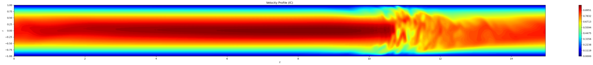

---

### Non-Rotating Case (N = 0)
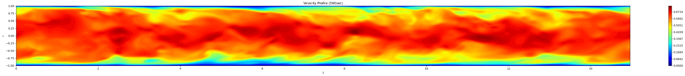

---

### Rotating Case (N = 4)


---

## Key Result

- Turbulence randomness observed at **N = 0** reduces significantly at **N = 4**
- At Re = 5300 and N = 4:
  ➝ Achieved **14% drag reduction**

---

# Project 2: 2D Lid-Driven Cavity Flow (SIMPLE Algorithm)

**Type:** Self-Developed CFD Solver  
**Language:** Python  
**Method:** Finite Volume Method (FVM)  
**Algorithm:** SIMPLE  

---

## Overview

Developed a 2D incompressible Navier–Stokes solver for the classical lid-driven cavity problem using the SIMPLE algorithm.

The solver includes:

- Momentum discretization using FVM
- Pressure correction equation
- Under-relaxation for stability
- Face velocity correction
- Residual monitoring and convergence tracking
- Post-processing (vorticity, divergence, streamlines)

---

## Numerical Setup

- Reynolds Number: **Re = 100**
- Grid size: **30 × 30**
- Domain: Unit square
- Lid velocity: **u = 1**
- No-slip walls on other boundaries
- Convergence based on L2 residual norms

---

## Results

### Velocity Magnitude + Streamlines
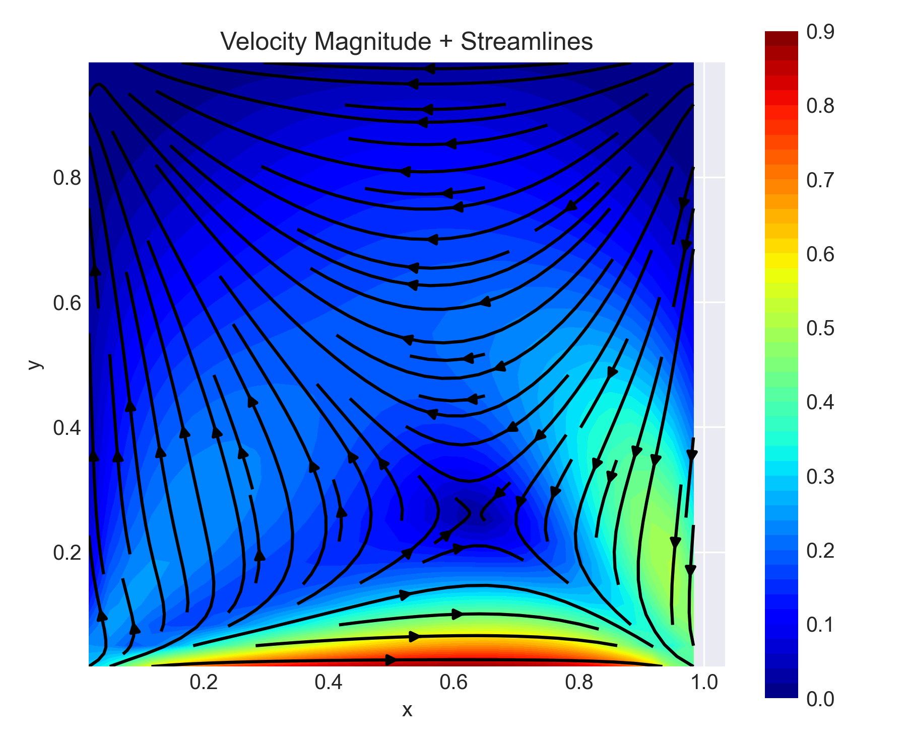

---

### Pressure Contours
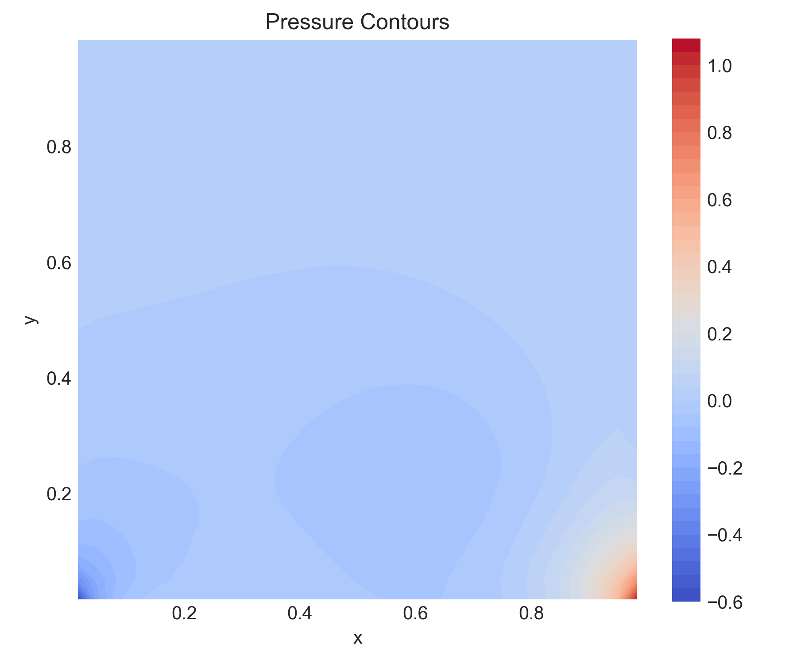

---

### Residual Convergence History
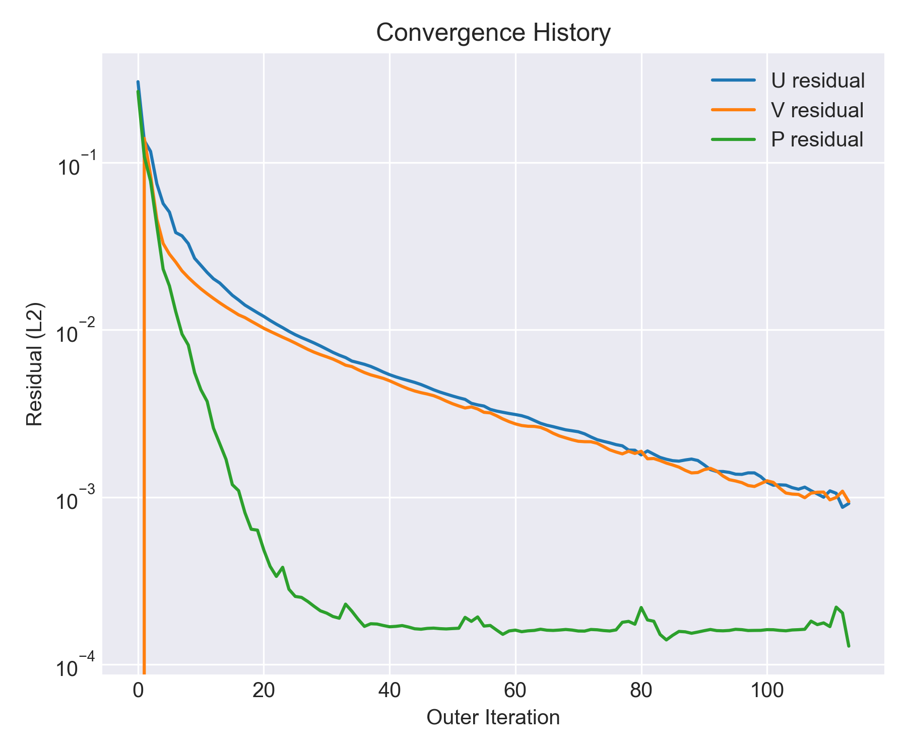

---

## Key Observations

- Formation of primary vortex at cavity center
- Secondary corner vortices captured at Re = 100
- Divergence ≈ 10⁻⁶ confirming mass conservation
- Stable convergence using under-relaxation (α_uv = 0.7, α_p = 0.2)

---

## Tech Stack

- Fortran 90  
- MPI  
- Python (NumPy, SciPy, Matplotlib)  
- HPC Execution  

---

# CAD and Prototyping Work (CATIA V5)

**Software:** CATIA V5 | Solidworks
**Focus:** Product Design | Surface Modeling | Prototyping  

---
## 1️⃣ Spool Holder (CAD + Prototype)

- Designed ergonomic spool holder assembly  
- CAD-to-physical prototype validation  
- 3D printed functional model  

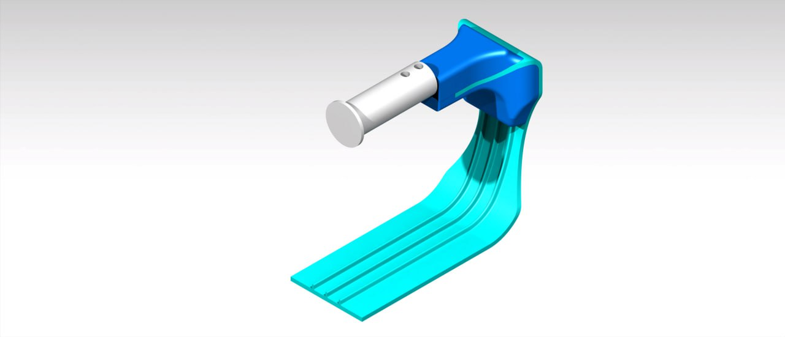  
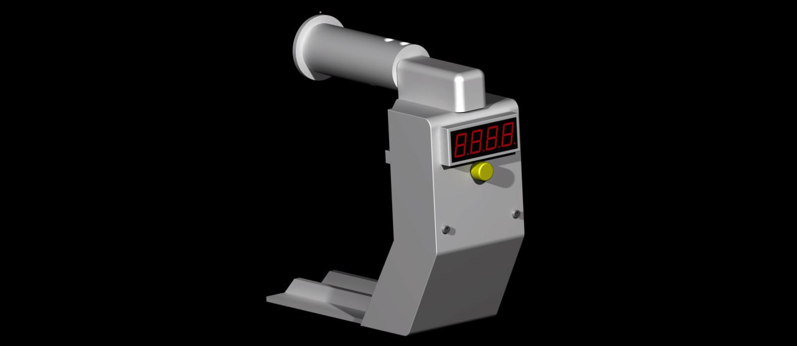  
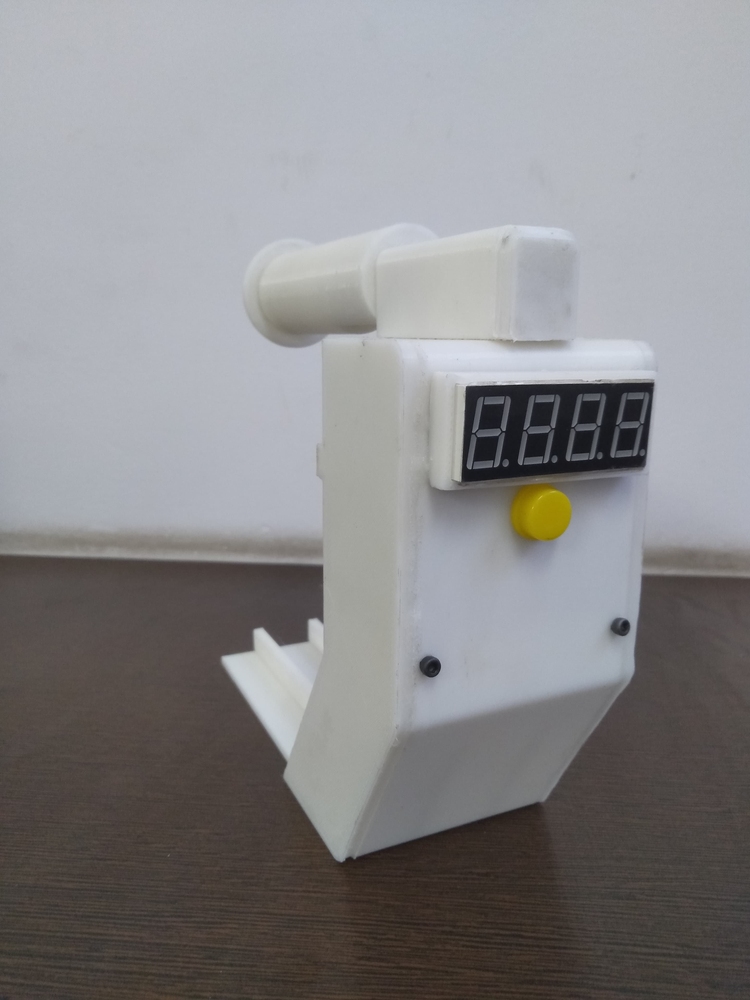

---

## 2️⃣ Biodegradable Bowl Design

- Developed cad model of biodegradable bowl (250ml capacity) using surcafing workbench 

  
  


---

## 3️⃣ Air Sampling Robot – Gripper Mechanism

- Designed and develop prototype of dual-link gripper mechanism arm for opening and closing the the air sampler inlet and changing petri dish.
– Selection of material, plating and electronic component for the same
– Performed workspace/reachability analysis of a robotic arm end-effector using MATLAB

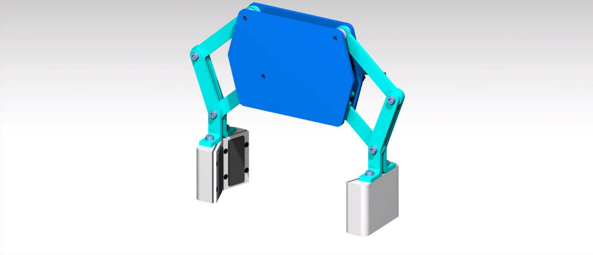

---

## 4️⃣ Battery Swapping Station

- Compact modular battery swapping concept  
- Integrated locking & guiding mechanism  
- Assembly-level design with internal component layout  

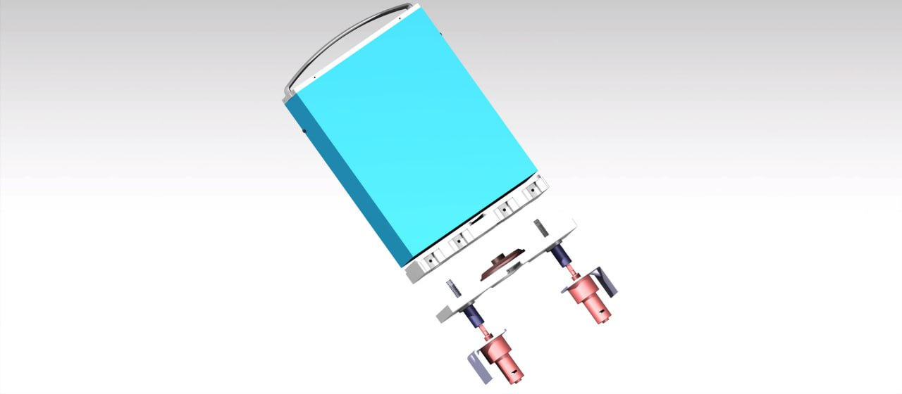  
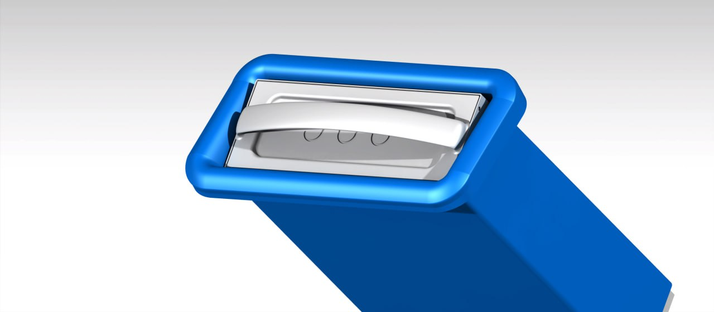

---
